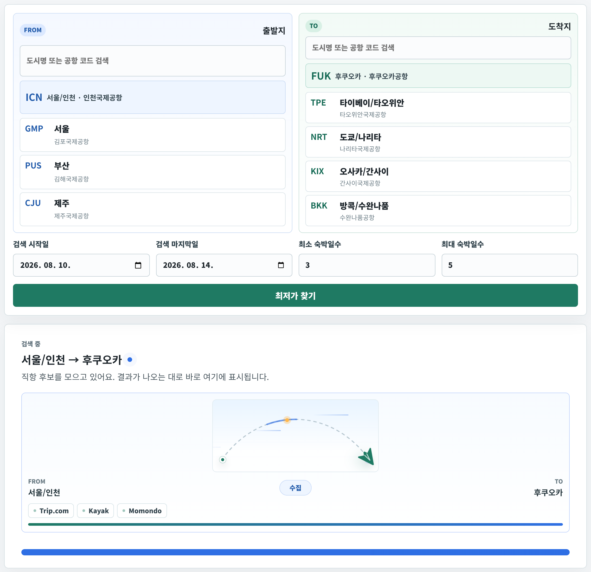
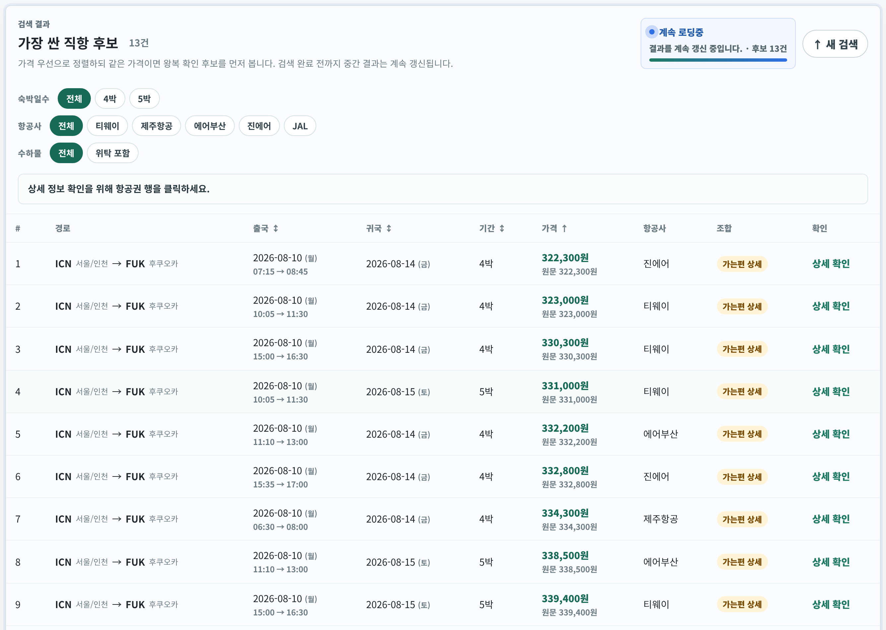
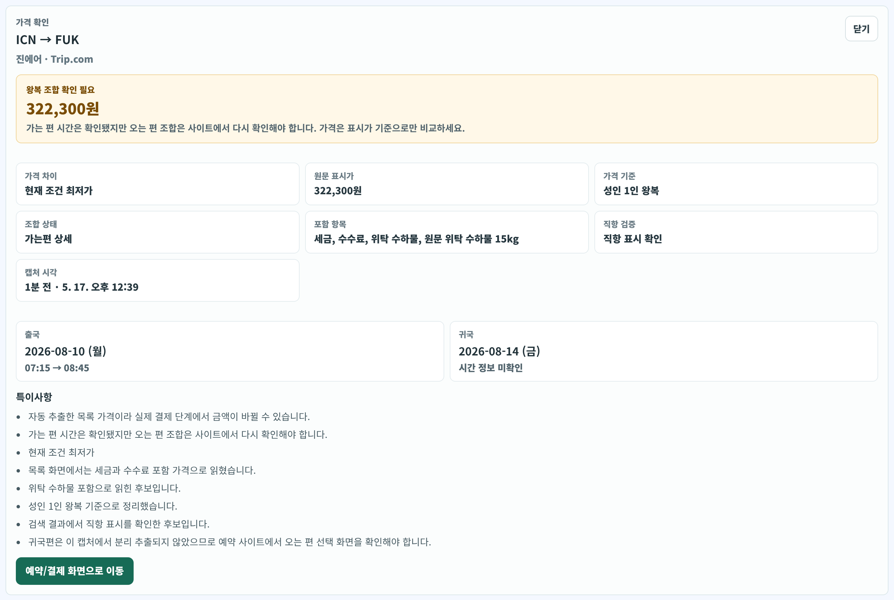

# ✈️ Search Cheapest Airplane
---

## 🚀 시작하기 — 2가지 중 편한 것

### A. 브라우저에서 바로 *(아무것도 설치 안 함, 가장 쉬움)*

[](https://codespaces.new/jjunsss/cheapest-flights?quickstart=1)

위 초록 버튼 → 환경 준비 후 터미널에 `npm run dev`.

### B. 노트북에서 직접

1. **Node.js 설치** *(처음 한 번만)* — <https://nodejs.org> 에서 LTS 다운로드 후 설치
2. **이 저장소 받기** — GitHub 페이지 초록 `Code` 버튼 → `Download ZIP` → 압축 풀기
3. **실행**:
   - **Windows** — `scripts` 폴더의 `start.bat` **더블클릭**
   - **macOS / Linux** — 터미널에서 `bash scripts/start.sh`

스크립트가 알아서 설치하고 브라우저까지 열어줍니다. 종료할 땐 `Ctrl + C`.

---

## 📖 사용법

### 1) 검색 입력


- **출발지 / 도착지** — 인기 공항 카드 또는 검색창에 도시명·IATA 코드
- **검색 시작일 / 마지막일** — 이 범위 안의 모든 (출국·귀국) 조합을 시도
- **최소 / 최대 숙박** — 찾으려는 박수 범위

### 2) 검색 중



검색 폼 바로 아래에 진행 박스가 뜨고 Trip.com / Kayak / Momondo에서 가격을 모읍니다. 결과가 나오는 즉시 박스가 사라지고 같은 자리에 결과 표가 등장합니다. 최종적으로 완료될때까지 지속적으로 업데이트 됩니다.

### 3) 결과 화면



- **가격 오름차순**으로 정렬

### 4) 행을 누르면 상세 정보



- 출국·귀국 시각, 비행시간, 항공사, 가격 원문, 예약 링크 정리
- 예약 화면으로 바로 이동 가능

### 5) 새 조건으로 다시 찾기


결과 카드 우측 상단의 **`↑ 새 검색`** 버튼 → 모두 리셋

---

## ⚠️ 알아둘 점

- **개인 용도** 도구.
- 가격은 실제 예약 시 다를 수 있음. 참고용.
- 수화물 등 예약 사이트에서 재점검 필요.
- 다른 사이트(현재 조사하는 것 이외)에서 더 쌀수도 있음.

---

<details>
<summary><strong>🛠 개발자용</strong></summary>

### 명령어

```sh
npm install              # 의존성
npx playwright install chromium
npm run dev              # 개발 서버 (front 5173 + back 3001)
npm run typecheck        # 타입 체크
npm test                 # 유닛 테스트
npm run build            # 프로덕션 빌드
```

### 환경 변수 (선택)

| 변수 | 기본값 | 설명 |
|---|---|---|
| `FLIGHT_MAX_PAIRS` | 18 | 한 도착지당 최대 (출국·귀국) 조합 수. 출발일과 숙박일수를 함께 넓게 커버 |
| `FLIGHT_PARALLEL` | 3 | 동시 실행 워커 수 (↑ 빠름 / 차단 위험↑) |
| `FLIGHT_SETTLE_MS` | 900 | 첫 가격 카드 감지 후 추가로 기다리는 안정화 시간 |
| `FLIGHT_BLOCK_HEAVY_RESOURCES` | 1 | 폰트·미디어·추적 요청 차단. `0`이면 비활성화 |
| `FLIGHT_BLOCK_IMAGES` | 0 | 이미지까지 차단. 빠를 수 있지만 일부 사이트 결과 누락 위험 |
| `FX_RATES_JSON` | — | 환율 수동 지정 — 예: `'{"USD":1380,"EUR":1490}'` |

### 폴더 구조

```
src/
  client/          React 프론트 (Vite)
  server/          Fastify 백엔드
    sources/       Trip / Kayak / Momondo 자동 스크래퍼
    domain/        날짜·환율·검증 로직
  shared/          프론트·백엔드 공용 타입, 공항 데이터
scripts/           start.sh / start.bat (원클릭 실행)
.devcontainer/     GitHub Codespaces 자동 셋업
docs/screenshots/  README용 화면 캡처
```

### 스크래핑 흐름

1. `manager.processRun`이 `generateDatePairs`로 (출국·귀국) 조합 생성 후 출발일·숙박일수 다양성을 함께 보며 조합 선택 (cap = `FLIGHT_MAX_PAIRS`)
2. `FLIGHT_PARALLEL`개 worker가 각자 Playwright `BrowserContext`를 갖고 큐에서 task 소비
3. 각 task는 이미지·폰트·미디어·추적 요청을 차단하고, 가격 카드가 감지되면 고정 대기 없이 바로 파싱
4. `src/server/sources/{kayak,momondo,trip}.ts`의 scraper 호출 → `parseCardText`로 가격·항공사·시각 추출
5. `scrapedToCandidate` → `insertCandidate` → SSE event로 진행률 push
6. 메인 소스 0건이면 `AUTO_SOURCES`의 나머지로 **자동 폴백**
7. 클라이언트는 1.5초마다 `/api/runs/:id` 폴링 + SSE 보강

### 데이터 위치

- SQLite: `data/flights.sqlite` (전체 검색·결과 기록, `.gitignore`)
- 리포트: `reports/<run-id>/{summary.md, candidates.csv, candidates.json, coverage.json}`

</details>
