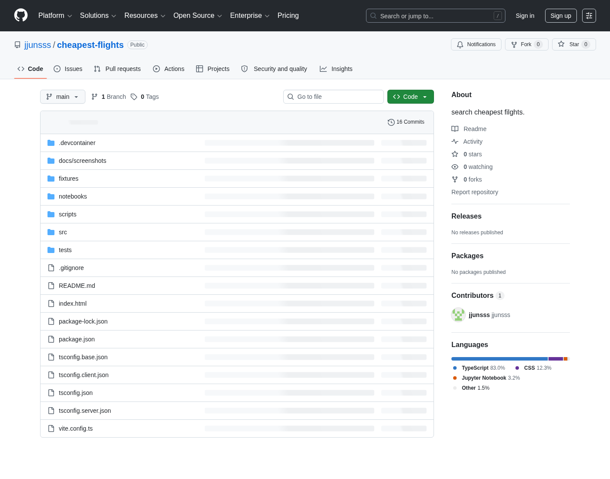
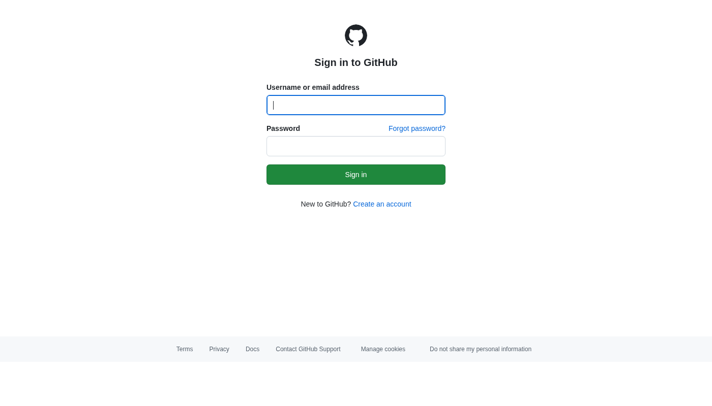
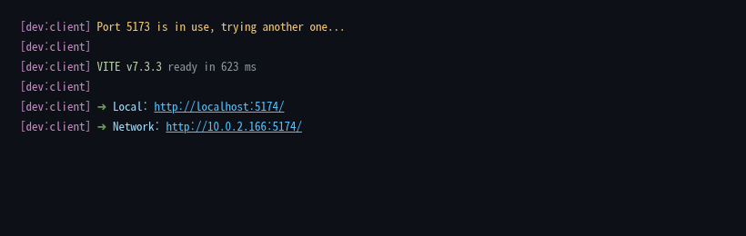
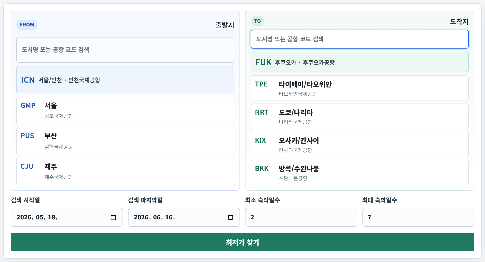

# Codespaces 단계별 화면 가이드

[← README로 돌아가기](../README.md)

> README의 **B. 원본 개발 환경 (Codespaces)** 단계와 같은 내용입니다. 각 단계마다 실제 화면을 함께 볼 수 있도록 정리했습니다.

---

## 1. 위 초록 `Open in GitHub Codespaces` 버튼 클릭

---

## 2. GitHub 로그인 (또는 가입)

계정이 없으면 화면 아래 **`Create an account`** 로 1분 안에 가입할 수 있습니다.

---

## 3. 다음 화면에서 초록 `Create codespace on main` 버튼 한 번 클릭

페이지가 단순합니다 — 가운데 큰 초록 버튼 하나만 누르면 됩니다.

> *(캡처 준비 중 — Codespace를 직접 띄울 때 `screenshots/codespaces/03-create.png`로 저장해두면 자동 노출됩니다.)*

---

## 4. 2분쯤 기다리기 — 자동으로 모든 게 깔립니다

VS Code 화면이 뜨고 아래쪽에 진행 메시지가 흘러갑니다. 가만히 기다리면 됩니다.

> *(캡처 준비 중 — `screenshots/codespaces/04-setup.png`)*

---

## 5. 잠시 후 화면 아래쪽에 시커먼 터미널 칸이 보이면 → 거기에 `npm run dev` 입력하고 **Enter**

터미널 출력은 이렇게 뜹니다:

---

## 6. 같은 터미널 화면에 뜬 `http://localhost:5173/` 또는 `https://xxxx-5173.app.github.dev` 같은 주소를 복사 → 새 탭 주소창에 붙여넣기

→ 새 탭에 앱이 열립니다.

---

[← README로 돌아가기](../README.md)
